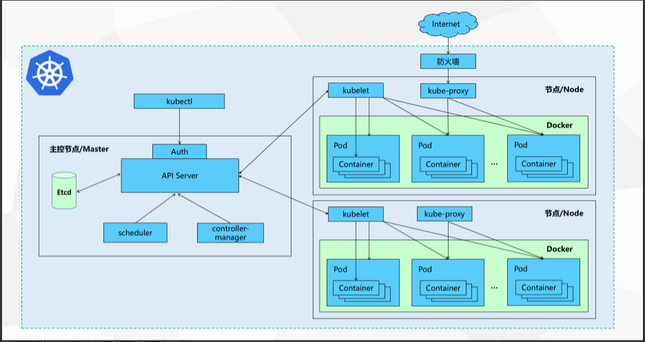

1. 安装要求

- 集群中所有机器之间网络互通
- 可以访问外网，需要拉取镜像
- 禁止swap分区

服务器规划

| 角色	| IP	| 组件| 
| ---  |  ---| ---| 
k8s-master	|192.168.1.31	| etcd
k8s-master1	| 192.168.1.32 | kube-apiserver，kube-controller-manager，kube-scheduler，etcd)
k8s-master2	| 192.168.1.33	| kube-apiserver，kube-controller-manager，kube-scheduler，etcd
k8s-node1	| 192.168.1.34	| kubelet，kube-proxy，docker
k8s-node2	| 192.168.1.35	| kubelet，kube-proxy，docker
Load Balancer（Master）	| 192.168.1.30，192.168.1.29 (VIP) | 	Nginx L4 haproxy  keepalived ipvs
Load Balancer（Backup）	| 192.168.1.31	|  Nginx L4 haproxy keepalived ipvs


## Service 和 Pods Ip 段划分

名称 | 	IP网段  |	备注
| ---  |  ---| ---| 
Service网络 | 10.254.0.0/16 |   虚拟网络，也叫集群网络(cluster server) 用于内部集群间通信构建于Pod网络之上，用于解决服务发现和负载均衡，通过kube-proxy链接pod网络和service网络 
node节点网络 | 192.168.1.30 |  宿主机网络
pod网络 | 172.7.0.0/16 | 容器运行的网络 建议pod网络与节点Ip绑定 如：节点ip192.168.1.31 则pod网络为172.7.31.0/24

---

## kubernete流程图



- 主控节点和node节点只是逻辑上的概念,物理上可以部署在一起


# 部署kubernent 1.18.8

### 基本软件部署

- hostnamecel set-hostname xxx
- getenforce  disabled
- yum install wget net-tools telnet tree nmap sysstat lrzsz dos2unix -y

###  部署DNS服务bind9

- 在`knd30`上安装bind的dns服务 `yum install bind bind-utils -y
`
- 修改并校验配置文件

```json
vim /etc/named.conf

listen-on port 53 { 192.168.1.30; }; 
allow-query     { any; };
forwarders      { 192.168.1.1; };
recursion yes;
dnssec-enable no;
dnssec-validation no
```
- forwarders  上一层DNS地址(网关或公网DNS)
- listen-on 监听地址
- allow-query 允许谁使用
- dnssec-enable  dns安全设置(测试时禁用)
- dnssec-validation  dns安全设置(测试时禁用)
- named-checkconf 检查配置文件是否正确

### 增加自定义域和对于配置

- 在域配置中增加自定义域

```json

vi /etc/named.rfc1912.zones
# 添加自定义主机域
zone "host.com" IN {
        type  master;
        file  "host.com.zone";
        allow-update { 192.168.1.30; };
};
# 添加自定义业务域
zone "knd.com" IN {
        type  master;
        file  "knd.com.zone";
        allow-update { 192.168.1.30; };
};
```

> host.com和knd.com都是我们自定义的域名,一般用host.com做为主机域</br>
> knd.com为业务域,业务不同可以配置多个


- 为自定义域host.com创建配置文件

```json
vi /vat/named/host.com.zone

$ORIGIN host.com.
$TTL 600	; 10 minutes			
@       IN SOA	dns.host.com. dnsadmin.host.com. (
				2021030301 ; serial
				10800      ; refresh (3 hours)
				900        ; retry (15 minutes)
				604800     ; expire (1 week)
				86400      ; minimum (1 day)
				)
			NS   dns.host.com.
$TTL 60	; 1 minute
dns              A    192.168.1.30
knd-30           A    192.168.1.30
knd-31           A    192.168.1.31
knd-32           A    192.168.1.32
knd-33           A    192.168.1.33
knd-34           A    192.168.1.34
knd-35           A    192.168.1.35
knd-5            A    192.168.1.5

```

- 为自定义域名knd.com创建配置文件

```json
 vi /var/named/knd.com.zone

 $ORIGIN knd.com.
$TTL 600	; 10 minutes
@   		IN SOA	dns.knd.com. dnsadmin.knd.com. (
				2021030301 ; serial
				10800      ; refresh (3 hours)
				900        ; retry (15 minutes)
				604800     ; expire (1 week)
				86400      ; minimum (1 day)
				)
				NS   dns.knd.com.
$TTL 60	; 1 minute
dns                A    192.168.1.30

```

> host.com域用于主机之间通信,所以要先增加上所有主机</br>
> knd.com域用于后面的业务解析用,因此不需要先添加主机

### 启动并验证DNS服务

- named-checkconf 
- systemctl start named
- ss -lntup | grep 53

- 验证 dig -t A knd32.host.com @192.168.1.30 +short

### 所有主机修改dns为192.168.1.30并添加search=host.com
- 重启network


## 运维服务器准备签发证书环境

```
wget https://pkg.cfssl.org/R1.2/cfssl_linux-amd64 -O /usr/bin/cfssl
wget https://pkg.cfssl.org/R1.2/cfssljson_linux-amd64 -O /usr/bin/cfssl-json
wget https://pkg.cfssl.org/R1.2/cfssl-certinfo_linux-amd64 -O /usr/bin/cfssl-certinfo
chmod +x /usr/bin/cfssl*
```

### 生成ca证书文件

``` shell
vi /opt/certs/ca-csr.json

{
    "CN": "zqcd",
    "hosts": [
    ],
    "key": {
        "algo": "rsa",
        "size": 2048
    },
    "names": [
        {
            "C": "CN",
            "ST": "chengdu",
            "L": "chengdu",
            "O": "zq",
            "OU": "ops"
        }
    ],
    "ca": {
        "expiry": "175200h"
    }
}
```
-  生成ca证书
`cfssl gencert -initca ca-csr.json | cfssl-json -bare ca`

### docker 环境准备

```json

mkdir -p /etc/docker

vi /etc/docker/daemon.json

{
  "graph": "/data/docker", 
  "storage-driver": "overlay2",
  "insecure-registries": ["registry.access.redhat.com","quay.io","harbor.knd.com"],
  "registry-mirrors": ["https://q2gr04ke.mirror.aliyuncs.com"],
  "bip": "172.7.31.1/24",
  "exec-opts": ["native.cgroupdriver=systemd"],
  "live-restore": true
}

```
> 注意bip要根据宿主机ip进行更改

### 启动docker
- mkdir -p /data/docker
- systemctl start docker
- systemctl enable docker


## 部署etcd

### 签发证书

```
scp knd@192.168.1.5:/opt/certs/ca.pem .
scp knd@192.168.1.5:/opt/certs/etcd-peer.pem .
scpknd@192.168.1.5:/opt/certs/etcd-peer-key.pem .
```

### 创建etcd启动脚本

```
useradd -s /sbin/nologin -M etcd
wget https://github.com/etcd-io/etcd/archive/v3.4.9.tar.gz
tar xf etcd-v3.4.9-linux-amd64.tar.gz -C /opt/
cd /opt/
mv etcd-v3.4.9-linux-amd64/ etcd-v3.4.9
ln -s /opt/etcd-v3.4.9/ /opt/etcd

mkdir -p /opt/etcd/certs /data/etcd /data/logs/etcd-server
chown -R etcd.etcd /opt/etcd-v3.4.9/
chown -R etcd.etcd /data/etcd/
chown -R etcd.etcd /data/logs/etcd-server/

```

```shell

vi   /opt/etcd/etcd-server-startup.sh 
#!/bin/sh
./etcd --name etcd-server-knd-31 \
       --data-dir /data/etcd/etcd-server \
       --listen-peer-urls https://192.168.1.31:2380 \
       --listen-client-urls https://192.168.1.31:2379,http://127.0.0.1:2379 \
       --quota-backend-bytes 8000000000 \
       --initial-advertise-peer-urls https://192.168.1.31:2380 \
       --advertise-client-urls https://192.168.1.31:2379,http://127.0.0.1:2379 \
       --initial-cluster  etcd-server-knd-31=https://192.168.1.31:2380,etcd-server-knd-32=https://192.168.1.32:2380,etcd-server-knd-33=https://192.168.1.33:2380 \
       --initial-cluster-state new \
       --enable-v2  \
       --cert-file ./certs/etcd-peer.pem \
       --key-file ./certs/etcd-peer-key.pem \
       --client-cert-auth  \
       --trusted-ca-file ./certs/ca.pem \
       --peer-cert-file ./certs/etcd-peer.pem \
       --peer-key-file ./certs/etcd-peer-key.pem \[program:etcd-server-knd-31]
command=/opt/etcd/etcd-server-startup.sh                        ; the program (relative uses PATH, can take args)	
numprocs=1                                                      ; number of processes copies to start (def 1)
directory=/opt/etcd                                             ; directory to cwd to before exec (def no cwd)
autostart=true                                                  ; start at supervisord start (default: true)
autorestart=true                                                ; retstart at unexpected quit (default: true)
startsecs=30                                                    ; number of secs prog must stay running (def. 1)
startretries=3                                                  ; max # of serial start failures (default 3)
exitcodes=0,2                                                   ; 'expected' exit codes for process (default 0,2)
stopsignal=QUIT                                                 ; signal used to kill process (default TERM)
stopwaitsecs=10                                                 ; max num secs to wait b4 SIGKILL (default 10)
user=etcd                                                       ; setuid to this UNIX account to run the program
redirect_stderr=true                                            ; redirect proc stderr to stdout (default false)
stdout_logfile=/data/logs/etcd-server/etcd.stdout.log           ; stdout log path, NONE for none; default AUTO
stdout_logfile_maxbytes=64MB                                    ; max # logfile bytes b4 rotation (default 50MB)
stdout_logfile_backups=4                                        ; # of stdout logfile backups (default 10)
stdout_capture_maxbytes=1MB                                     ; number of bytes in 'capturemode' (default 0)
stdout_events_enabled=false                                     ; emit events on stdout writes (default false)

       --peer-client-cert-auth \
       --peer-trusted-ca-file ./certs/ca.pem \
       --logger=zap

```

-  chmod +x /opt/etcd/etcd-server-startup.sh

- 使用supervisor启动etcd

```shell
yum install supervisor -y
systemctl start supervisord
systemctl enable supervisord

```

- 创建启动脚本

```ini

[program:etcd-server-knd-31]
command=/opt/etcd/etcd-server-startup.sh                        ; the program (relative uses PATH, can take args)	
numprocs=1                                                      ; number of processes copies to start (def 1)
directory=/opt/etcd                                             ; directory to cwd to before exec (def no cwd)
autostart=true                                                  ; start at supervisord start (default: true)
autorestart=true                                                ; retstart at unexpected quit (default: true)
startsecs=30                                                    ; number of secs prog must stay running (def. 1)
startretries=3                                                  ; max # of serial start failures (default 3)
exitcodes=0,2                                                   ; 'expected' exit codes for process (default 0,2)
stopsignal=QUIT                                                 ; signal used to kill process (default TERM)
stopwaitsecs=10                                                 ; max num secs to wait b4 SIGKILL (default 10)
user=etcd                                                       ; setuid to this UNIX account to run the program
redirect_stderr=true                                            ; redirect proc stderr to stdout (default false)
stdout_logfile=/data/logs/etcd-server/etcd.stdout.log           ; stdout log path, NONE for none; default AUTO
stdout_logfile_maxbytes=64MB                                    ; max # logfile bytes b4 rotation (default 50MB)
stdout_logfile_backups=4                                        ; # of stdout logfile backups (default 10)
stdout_capture_maxbytes=1MB                                     ; number of bytes in 'capturemode' (default 0)
stdout_events_enabled=false                                     ; emit events on stdout writes (default false)

```

- 启动etcd服务并检查

```bin
supervisorctl update
supervisorctl status
netstat -lntup|grep etcd

```

- 检查集群状态

```shell

 etcdctl  --cacert=/opt/etcd/certs/ca.pem --cert=/opt/etcd/certs/etcd-peer.pem --key=/opt/etcd/certs/etcd-peer-key.pem  --endpoints="https://192.168.1.30:2379,https://192.168.1.31:2379,https://192.168.1.32:2379" endpoint health

etcdctl member list
 ```


 ## 部署kube-apiserver服务


 - 下载页面: https://github.com/kubernetes/kubernetes/blob/master/CHANGELOG/CHANGELOG-1.18.md

 - `wget  https://dl.k8s.io/v1.18.8/kubernetes-server-linux-amd64.tar.gz `


 ### 签发证书

 ```


 ```
 scp knd@192.168.1.5:/opt/certs/ca.pem .
scp knd@192.168.1.5:/opt/certs/ca-key.pem .
scp knd@192.168.1.5:/opt/certs/client.pem .
scp knd@192.168.1.5:/opt/certs/client-key.pem .
scp knd@192.168.1.5:/opt/certs/apiserver.pem .
scp knd@192.168.1.5:/opt/certs/apiserver-key.pem .


stream {
    upstream kube-apiserver {
        server 192.168.1.32:6443     max_fails=3 fail_timeout=30s;
        server 192.168.1.33:6443     max_fails=3 fail_timeout=30s;
    }
    server {
        listen 7443;
        proxy_connect_timeout 2s;
        proxy_timeout 900s;
        proxy_pass kube-apiserver;
    }
}


! Configuration File for keepalived
global_defs {
   router_id 192.168.1.30
}
vrrp_script chk_nginx {
    script "/etc/keepalived/check_port.sh 7443"
    interval 2
    weight -20
}
vrrp_instance VI_1 {
    state MASTER
    interface p8p1
    virtual_router_id 251
    priority 100
    advert_int 1
    mcast_src_ip 192.168.1.30
    nopreempt

    authentication {
        auth_type PASS
        auth_pass 11111111
    }
    track_script {
         chk_nginx
    }
    virtual_ipaddress {
        192.168.1.29
    }
}


! Configuration File for keepalived
global_defs {
    router_id 192.168.1.32
}
vrrp_script chk_nginx {
    script "/etc/keepalived/check_port.sh 7443"
    interval 2
    weight -20
}
vrrp_instance VI_1 {
    state BACKUP
    interface p8p1
    virtual_router_id 251
    mcast_src_ip 192.168.1.32
    priority 90
    advert_int 1
    authentication {
        auth_type PASS
        auth_pass 11111111
    }
    track_script {
        chk_nginx
    }
    virtual_ipaddress {
        192.168.1.29
    }
}


scp knd@192.168.1.5:/opt/certs/kubelet.pem .
scp knd@192.168.1.5:/opt/certs/kubelet-key.pem .


kubectl config set-cluster myk8s \
    --certificate-authority=/opt/kubernetes/server/bin/cert/ca.pem \
    --embed-certs=true \
    --server=https://192.168.1.29:7443 \
    --kubeconfig=kubelet.kubeconfig


    kubectl config set-credentials k8s-node \
    --client-certificate=/opt/kubernetes/server/bin/cert/client.pem \
    --client-key=/opt/kubernetes/server/bin/cert/client-key.pem \
    --embed-certs=true \
    --kubeconfig=kubelet.kubeconfig


scp knd@192.168.1.5:/opt/certs/kube-proxy-client.pem .
scp knd@192.168.1.5:/opt/certs/kube-proxy-client-key.pem .


kubectl config set-cluster myk8s \
    --certificate-authority=/opt/kubernetes/server/bin/cert/ca.pem \
    --embed-certs=true \
    --server=https://192.168.1.29:7443 \
    --kubeconfig=kube-proxy.kubeconfig


kubectl config set-credentials kube-proxy \
    --client-certificate=/opt/kubernetes/server/bin/cert/kube-proxy-client.pem \
    --client-key=/opt/kubernetes/server/bin/cert/kube-proxy-client-key.pem \
    --embed-certs=true \
    --kubeconfig=kube-proxy.kubeconfig


    #!/bin/sh
./kube-proxy \
  --hostname-override hdss7-21.host.com \
  --cluster-cidr 172.7.0.0/16 \
  --proxy-mode=ipvs \
  --ipvs-scheduler=nq \
  --kubeconfig ../conf/kube-proxy.kubeconfig


scp knd@192.168.1.5:/opt/certs/ca.pem         cert/ 
scp knd@192.168.1.5:/opt/certs/client.pem     cert/ 
scp knd@192.168.1.5:/opt/certs/client-key.pem cert/ 


iptables -t nat -I POSTROUTING -s 172.7.35.0/24 ! -d 172.7.0.0/16 ! -o docker0  -j MASQUERADE
